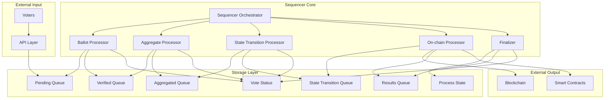
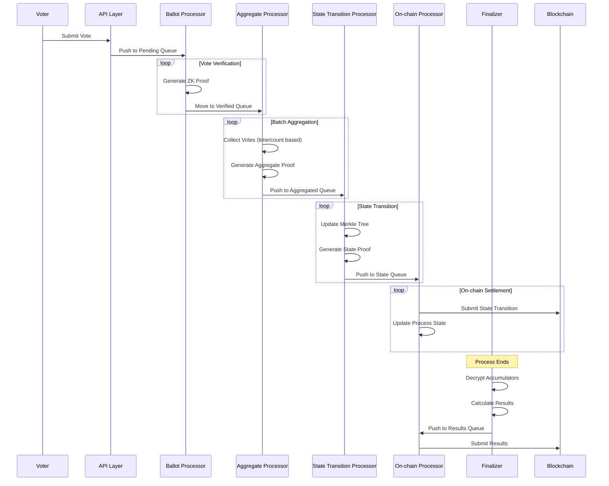
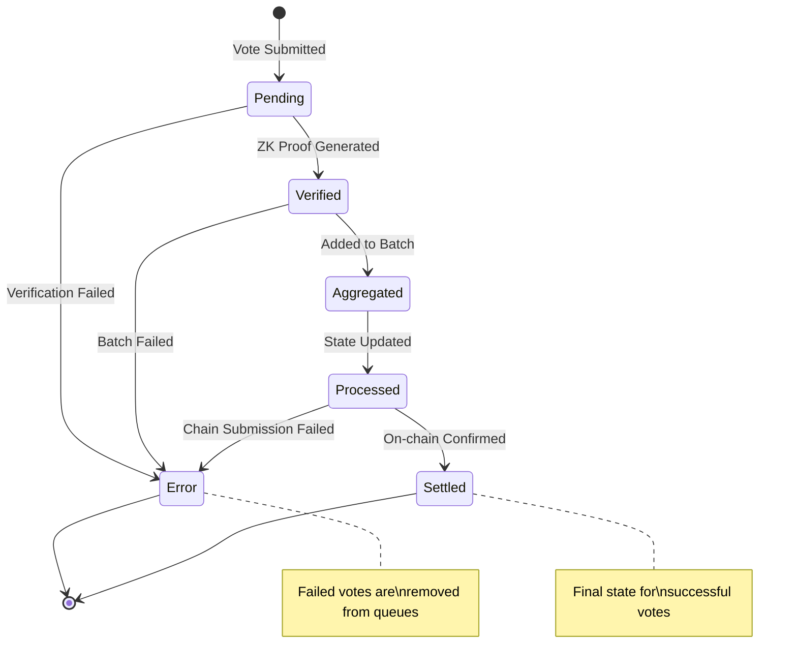
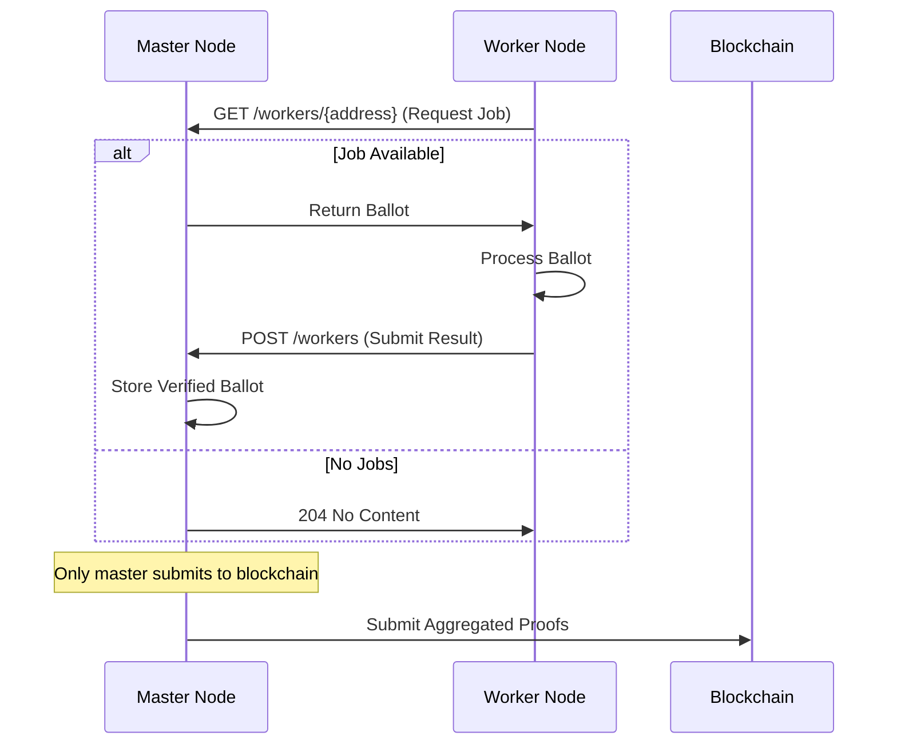

# Sequencer Architecture and Vote Processing Pipeline

## Overview

The Sequencer is the core component of the Davinci node responsible for processing votes through a multi-stage pipeline that includes zero-knowledge proof generation, state transitions, and blockchain settlement. It orchestrates the transformation of raw ballots into cryptographically verified results published on-chain.

## System Architecture



### Component Responsibilities

- **Sequencer Orchestrator**: Manages lifecycle of all processors and coordinates process registration
- **Ballot Processor**: Generates zero-knowledge proofs for individual vote verification
- **Aggregate Processor**: Batches verified votes and creates aggregated proofs
- **State Transition Processor**: Updates Merkle tree state with vote batches
- **On-chain Processor**: Submits proofs to blockchain and publishes results
- **Finalizer**: Handles process completion, decryption, and results calculation

## Vote Processing Pipeline



## Queue System Architecture

The storage layer implements a sophisticated queue system with reservation mechanisms to ensure reliable processing:

```
┌─────────────────┐    ┌─────────────────┐    ┌─────────────────┐
│   Pending       │    │   Verified      │    │   Aggregated    │
│   Ballots       │───▶│   Ballots       │───▶│   Batches       │
│   (b/)          │    │   (vb/)         │    │   (ag/)         │
└─────────────────┘    └─────────────────┘    └─────────────────┘
         │                       │                       │
         ▼                       ▼                       ▼
┌─────────────────┐    ┌─────────────────┐    ┌─────────────────┐
│   Reservations  │    │   Reservations  │    │   Reservations  │
│   (br/)         │    │   (vbr/)        │    │   (agr/)        │
└─────────────────┘    └─────────────────┘    └─────────────────┘

┌─────────────────┐    ┌─────────────────┐
│   State         │    │   Verified      │
│   Transitions   │───▶│   Results       │
│   (st/)         │    │   (vr/)         │
└─────────────────┘    └─────────────────┘
         │                       │
         ▼                       ▼
┌─────────────────┐    ┌─────────────────┐
│   Reservations  │    │   Vote Status   │
│   (str/)        │    │   (vs/)         │
└─────────────────┘    └─────────────────┘
```

### Queue Operations

Each queue supports atomic operations:
- **Push**: Add new items with automatic key generation
- **Next**: Retrieve and reserve the next available item
- **MarkDone**: Complete processing and remove item
- **MarkFailed**: Handle failures and update statistics

### Reservation System

The reservation system prevents double processing:
- Items are reserved when retrieved by processors
- Reservations include timestamps for stale cleanup
- Failed processors release reservations automatically
- System recovery clears all reservations on startup

## Processing Components

### Ballot Processor

**Purpose**: Transforms raw ballots into cryptographically verified votes

**Operation**:
1. Continuously polls pending ballot queue
2. Validates ballot structure and signatures
3. Generates zero-knowledge proofs using vote verifier circuit
4. Stores verified ballots with proofs

**Key Features**:
- Concurrent processing with worker lock
- Process ID filtering (only registered processes)
- Automatic retry on transient failures
- Statistics tracking for throughput monitoring

### Aggregate Processor

**Purpose**: Batches verified votes for efficient state transitions

**Batching Strategy**:
- **Count-based**: Process when reaching `VotesPerBatch` votes
- **Time-based**: Process after `batchTimeWindow` elapsed since first vote
- **Dummy filling**: Pad incomplete batches with dummy proofs

**Operation Flow**:
1. Monitor registered processes for verified votes
2. Apply batching criteria per process
3. Generate recursive aggregation proofs
4. Store aggregated batches for state processing

### State Transition Processor

**Purpose**: Updates process state with vote batches

**State Management**:
- Maintains Merkle tree of all votes
- Tracks vote counts and overwrites
- Generates proofs of state transitions
- Preserves state history for verification

**Proof Generation**:
- Creates witnesses for state transition circuit
- Includes aggregated proofs as recursive inputs
- Validates state consistency before and after

### On-chain Processor

**Dual Responsibility**:
1. **State Transitions**: Submit state proofs to blockchain
2. **Results**: Publish final results after finalization

**State Transition Flow**:
1. Retrieve ready state transition batches
2. Convert proofs to Solidity-compatible format
3. Simulate transaction to detect failures
4. Submit to ProcessRegistry contract
5. Update local process state on confirmation

**Results Flow**:
1. Monitor for verified results
2. Convert results proofs for contract
3. Submit to blockchain with retry logic
4. Mark results as published

### Finalizer

**Purpose**: Handles process completion and results calculation

**Finalization Triggers**:
- **Time-based**: Processes that have exceeded their duration
- **On-demand**: Explicit finalization requests

**Decryption Process**:
1. Retrieve encrypted vote accumulators from state
2. Decrypt using process encryption keys
3. Calculate final results (add - subtract accumulators)
4. Generate zero-knowledge proof of correct decryption
5. Store verified results for on-chain publication

## State Management

### Vote Status Progression



### Process State Evolution

- **StateRoot**: Merkle root of all votes in the process
- **VoteCount**: Total number of accepted votes
- **VoteOverwriteCount**: Number of vote updates/overwrites
- **Status**: Process lifecycle state (Ready → Ended → Results)

## Concurrency and Synchronization

### Lock Hierarchy

```
Global Lock (Storage Operations)
├── Worker Lock (Ballot Processing)
└── Work-in-Progress Lock (Batch Processing)
```

**Global Lock**: Protects all storage operations and statistics
**Worker Lock**: Coordinates between master and worker ballot processing
**Work-in-Progress Lock**: Prevents concurrent batch/state processing

### Goroutine Architecture

Each processor runs in dedicated goroutines:
- **Ballot Processor**: Continuous polling with adaptive sleep
- **Aggregate Processor**: Ticker-based with configurable intervals
- **State Transition Processor**: Ticker-based processing
- **On-chain Processor**: Dual tickers for transitions and results
- **Finalizer**: Event-driven with periodic monitoring

## Worker Mode Architecture

### Master-Worker Communication



### Scaling Characteristics

- **Horizontal Scaling**: Add workers for ballot verification
- **Bottlenecks**: Aggregation and state transitions remain centralized
- **Load Balancing**: Round-robin job assignment
- **Fault Tolerance**: Failed workers don't block progress

## Error Handling and Recovery

### Failure Scenarios

1. **Ballot Verification Failure**:
   - Remove from pending queue
   - Mark vote status as error
   - Update process statistics

2. **Batch Processing Failure**:
   - Revert aggregation statistics
   - Mark constituent votes as error
   - Release reservations for retry

3. **State Transition Failure**:
   - Preserve batch for retry
   - Log detailed error information
   - Continue with other processes

4. **On-chain Submission Failure**:
   - Retry with exponential backoff
   - Simulate transactions to identify issues
   - Preserve proofs for manual intervention

### Recovery Mechanisms

- **Stale Reservation Cleanup**: Automatic cleanup of abandoned reservations
- **Process Monitoring**: Automatic detection of ended processes
- **Statistics Reconciliation**: Periodic validation of vote counts
- **Graceful Shutdown**: Proper cleanup of all goroutines and resources

